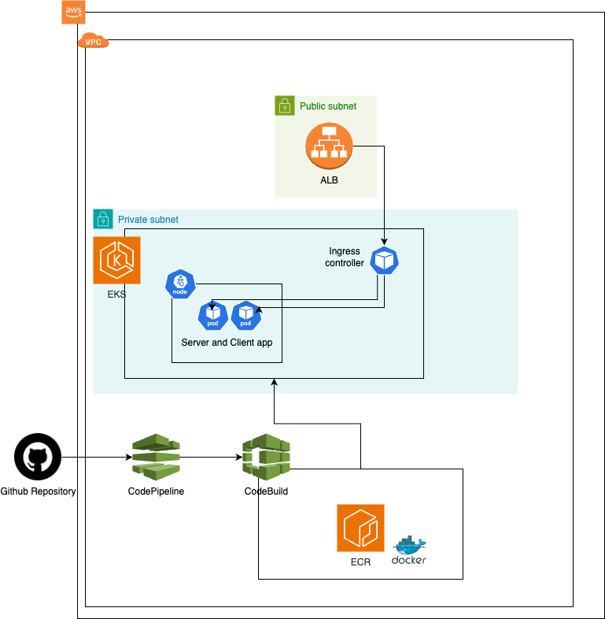

# PYTHON Grpc Application

## Tools/Languages

- Python
- Terraform
- AWS
- Kubernetes

## Architecture diagram



## What is a Grpc?

Please check [this documentation](https://grpc.io/docs/languages/python/basics/)

## Pre requisites

- AWS Account
- Terraform

## Install

- Download/clone this repository  `https://github.com/alejajessi/py-app-rpc.git`
- Configure your AWS credentials as environment variables `AWS_ACCESS_KEY_ID` y `AWS_SECRET_ACCESS_KEY`
- Create one bucket for terraform.state (In our case is called `py-app-state`)
- Open a terminal to execute some terraform commands:

            (You should be located in the root of the project)
            ```
            cd ./terraform
            terraform init --reconfigure
            terraform plan ## Please check the plan
            terraform apply 
            ```

- Now, Open your AWS Console and in search, please write AWS CodeBuild
    - Select your new compile project called `py-app-rpc`
    - Clic on `Iniciar compilación` or `Start build`
    
## Future work

According with the architecture diagram, it's pending implement AWS Code Pipeline to finish our CI/CD

## Run python app in local

The only prerequisite is to have docker installed and the docker daemon running.
Please execute this command in your terminal `docker-compose up --build` to start our server
Finally open another terminal window and execute  `python3 main.py --type 0`

# Networking

We've two modules into terraform directory: 
- eks
- network
Those modules are linked because we're using the infrastructure created in network module for our eks cluster.

In the network module, we've one child module `terraform-aws-modules/vpc/aws` and this is the [repository](https://github.com/terraform-aws-modules/terraform-aws-vpc) for that child module.
But we configured some custom values:
